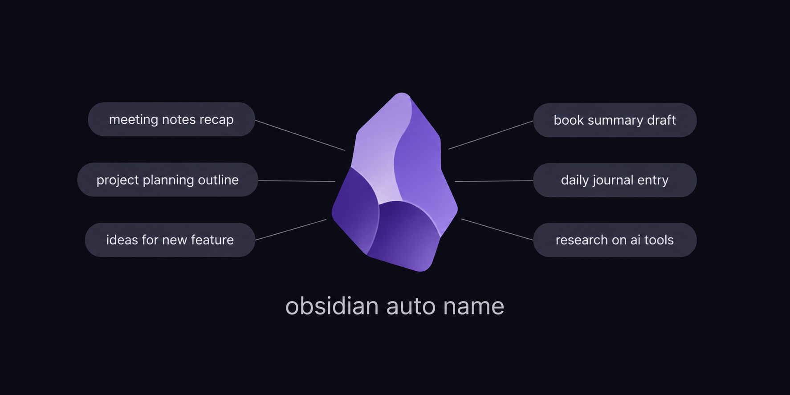

<p align="center">
  
</p>

Renames Untitled Obsidian notes from their content using a local Ollama LLM. Wikilinks update automatically; empty Untitled notes are cleaned up.

## Contents

- [What it does](#what-it-does)
- [Quick start](#quick-start)
- [Daily run](#daily-run)
- [Manual runs](#manual-runs)
- [Configuration](#configuration)
- [Design notes](#design-notes)
- [Repo layout](#repo-layout)

## What it does

- **Renames Untitled notes from their content.** Each note's body becomes a short descriptive title; the file is renamed in place.
- **Updates wikilinks automatically.** Any `[[Untitled N]]` references elsewhere in your vault get rewritten to the new filename — no dangling links.
- **Cleans up empty Untitled notes.** Notes you opened and never wrote in are deleted rather than left to clutter the vault.
- **Per-note opt-out.** Add `auto_name: false` to a note's frontmatter and the script will skip it forever.
- **Designed to run on its own.** Point a nightly cron at your vault and forget it.

## Quick start

You need:

- **[Ollama](https://ollama.com)** running locally with `qwen2.5:7b` pulled (or whichever model you configure).
- **Python 3.11+** on Linux, or **3.13 specifically** on macOS (3.14+ has a Local Network privacy quirk — see [Design notes](#design-notes)).

```bash
git clone https://github.com/undergroundpost/obsidian-auto-name.git
cd obsidian-auto-name
python3 -m venv .venv
.venv/bin/pip install -r requirements.txt
cp config.yaml.example config.yaml
# edit config.yaml — at minimum, set INPUT_FOLDER to your vault path
```

Preview the next run without touching any files:

```bash
.venv/bin/python rename_notes.py --dry-run --limit 5
```

Drop `--dry-run` once you're happy with the output.

## Daily run

Pick the path that matches your setup.

### Local vault

For a vault that lives on the same machine the cron runs on:

```cron
30 0 * * * /path/to/obsidian-auto-name/.venv/bin/python /path/to/obsidian-auto-name/rename_notes.py
```

The script writes its own dated log to `logs/rename_notes_YYYY-MM-DD.log`.

### Headless server with Obsidian Sync

If your vault lives in [Obsidian Sync](https://obsidian.md/sync) and you want this script to run on an always-on server, use Obsidian's official [headless client](https://obsidian.md/help/sync/headless) to pull and push around each run.

If you've already set up [obsidian-auto-tagger](https://github.com/undergroundpost/obsidian-auto-tagger) on the same server, `obsidian-headless` is already installed and paired — skip to the cron step. Otherwise:

```bash
npm install -g obsidian-headless
ob sync-setup    # interactive — pair to your Obsidian Sync vault
```

Then schedule the bundled wrapper, which does `ob sync` → rename → `ob sync`:

```cron
30 0 * * * /path/to/obsidian-auto-name/run-daily.sh
```

If you're running the tagger on the same server, stagger the two — they share `ob sync` and Ollama and shouldn't compete.

## Manual runs

```bash
.venv/bin/python rename_notes.py                       # default: process all matching files
.venv/bin/python rename_notes.py --dry-run --limit 5   # preview without writing
.venv/bin/python rename_notes.py --limit 5             # process at most 5
.venv/bin/python rename_notes.py --debug               # verbose logging
```

## Configuration

| Key                          | Default                  | Notes                                                       |
|------------------------------|--------------------------|-------------------------------------------------------------|
| `INPUT_FOLDER`               | `~/Documents/Notes`      | Vault root                                                  |
| `EXCLUDE_FOLDERS`            | `[]`                     | Subtrees to skip                                            |
| `LLM_PROVIDER`               | `ollama`                 | Only ollama supported                                       |
| `OLLAMA_MODEL`               | `qwen2.5:7b`             | Title-generation model                                      |
| `OLLAMA_SERVER_ADDRESS`      | `http://localhost:11434` | Ollama endpoint                                             |
| `OLLAMA_CONTEXT_WINDOW`      | `32000`                  | `num_ctx`                                                   |
| `RENAME_PATTERNS`            | `["Untitled","New Note"]`| Literal basenames that trigger renaming; ` N` suffix auto-handled |
| `MAX_TITLE_WORDS`            | `3`                      | Hard cap on words in the title; extras trimmed              |
| `TITLE_CASE`                 | `title`                  | `title` \| `sentence` \| `lower` (preserves acronyms)       |
| `TITLE_TEMPLATE`             | `"{title}"`              | Filename template; `{title}` and `{date}` are substituted   |
| `CONFIDENCE_THRESHOLD`       | `0.5`                    | LLM confidence below this triggers first-line fallback      |
| `MAX_FILENAME_CHARS`         | `50`                     | Hard cap on final filename length (excluding `.md`)         |
| `OPT_OUT_FRONTMATTER_KEY`    | `"auto_name"`            | Frontmatter key — value `false` opts a note out entirely    |
| `DELETE_EMPTY_UNTITLED`      | `true`                   | Delete Untitled notes whose body is below the threshold     |
| `EMPTY_NOTE_BODY_MIN_CHARS`  | `1`                      | Threshold for "empty" — body chars after frontmatter strip  |
| `MAX_NOTE_AGE_DAYS`          | `0`                      | If > 0, only process notes modified in last N days          |

## Design notes

- **Title-resolution cascade.** The script tries four sources in priority order: (1) an explicit `title:` field in frontmatter — skipped if it itself looks like an Untitled name, defending against templating plugins that auto-fill it; (2) an H1 heading on the first non-blank line — fast path, no LLM call; (3) the LLM, returning `{title, confidence}` under a grammar-constrained JSON schema; (4) the note's first non-blank line as a Notion-style fallback when LLM confidence is below `CONFIDENCE_THRESHOLD`. The cascade keeps obvious cases cheap and degrades gracefully when the model isn't sure.

- **Schema-enforced output.** Same pattern as the sibling `obsidian-auto-tagger`: Ollama's `format` field with a JSON schema means the model can't return prose or skip the title field. Word-count enforcement happens in Python after parsing rather than in the schema — regex-based length constraints in JSON schemas are inconsistent across models.

- **Wikilink rewrite is per-file.** For each rename, the script greps the vault for `[[<old-basename>]]` and `[[<old-basename>|Display]]` references and rewrites them (preserving display text) before renaming the file. In practice users rarely link to "Untitled N" by name, but the pass is cheap and prevents the dangling-link case.

- **Filename collisions resolved by suffix.** If the LLM picks "Meeting Notes" but that file already exists, the new name becomes "Meeting Notes 2.md", then "Meeting Notes 3.md", and so on.

- **The filename itself is the idempotency marker.** Once a note is no longer named "Untitled", subsequent runs ignore it. No frontmatter timestamp needed — by definition the work has already been done.

- **macOS Local Network privacy is per-binary.** Each Homebrew Python minor version is treated as a separate binary by the macOS permission system. New venvs that talk to Ollama on a non-localhost address must be created with the same `python@3.13` binary that has the Local Network grant, or LAN calls will silently fail with `EHOSTUNREACH`. This quirk only applies on macOS; on Linux any Python 3.11+ works.

## Repo layout

```
rename_notes.py        # main script (entry point for cron)
rename_notes.md        # prompt template
config.yaml.example    # config template (commit this)
config.yaml            # your local config (gitignored, copied from .example)
requirements.txt       # Python deps
run-daily.sh           # cron wrapper: ob sync → python → ob sync
.venv/                 # gitignored
logs/                  # dated log per run
```
